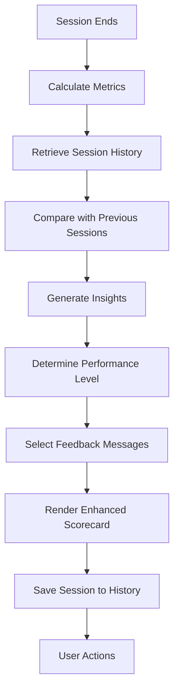

# Design Document: Scorecard Enhancements

## Overview

This design transforms the SessionSummary component from a basic metrics display into an intelligent, engaging performance dashboard. The enhanced scorecard will provide contextual feedback, track progress over time, and guide users toward continued improvement. The design leverages existing session data structures while adding new capabilities for historical comparison and personalized insights.

## Architecture

### Component Structure

```
SessionSummary (Enhanced)
├── PerformanceHeader
│   ├── Title with emoji based on performance
│   └── Overall performance badge
├── MetricsSection
│   ├── PrimaryMetricCard (Tracking Accuracy)
│   │   ├── Visual indicator (color-coded)
│   │   ├── Comparison with previous session
│   │   └── Trend indicator
│   ├── DurationMetricCard
│   │   └── Progress toward target
│   └── DataQualityMetricCard
│       └── Gaze points collected
├── LevelSpecificSection
│   ├── Level name and description
│   └── Level-specific metrics with targets
├── InsightsSection
│   ├── Performance feedback message
│   ├── Strengths identified
│   └── Improvement suggestions
├── ProgressSection (if previous sessions exist)
│   ├── Comparison indicators
│   ├── Personal best badges
│   └── Streak information
└── ActionsSection
    ├── Primary action (Play Again / Try Different Level)
    ├── Secondary actions
    └── AI analysis status
```

### Data Flow



## Components and Interfaces

### 1. Enhanced SessionSummary Component

**Props Interface:**
```typescript
interface SessionSummaryProps {
  sessionData: SessionData
  onClose: () => void
  onPlayAgain?: () => void
  onTryDifferentLevel?: () => void
}

interface SessionData {
  level: string
  startTime: number
  endTime: number
  gazeData: GazePoint[]
  events: GameEvent[]
  metrics?: SessionMetrics
}

interface SessionMetrics {
  totalGazePoints: number
  accurateGazes: number
  accuracyPercentage: number
  // Level-specific
  objectsFollowed?: number
  averageFollowTime?: number
  collisionsAvoided?: number
  totalCollisions?: number
  patternsIdentified?: number
  distractorsIgnored?: number
}
```

### 2. Session History Manager

**Purpose:** Store and retrieve session history for progress tracking

```typescript
interface SessionHistoryEntry {
  sessionId: string
  timestamp: number
  level: string
  duration: number
  trackingAccuracy: number
  levelMetrics: Record<string, number>
}

interface SessionHistory {
  entries: SessionHistoryEntry[]
  personalBests: {
    [level: string]: {
      accuracy: number
      sessionId: string
      timestamp: number
    }
  }
}

class SessionHistoryManager {
  private static STORAGE_KEY = 'focusflow_session_history'
  private static MAX_ENTRIES = 50 // Keep last 50 sessions
  
  static saveSession(entry: SessionHistoryEntry): void
  static getHistory(): SessionHistory
  static getPreviousSession(level: string): SessionHistoryEntry | null
  static getPersonalBest(level: string): SessionHistoryEntry | null
  static clearHistory(): void
}
```

**Storage Strategy:**
- Use localStorage for client-side persistence
- Store last 50 sessions to prevent storage bloat
- Organize by level for easy comparison
- Track personal bests separately for quick access

### 3. Performance Analyzer

**Purpose:** Analyze session data and generate insights

```typescript
interface PerformanceAnalysis {
  performanceLevel: 'excellent' | 'good' | 'moderate' | 'needs-improvement'
  feedbackMessage: string
  strengths: string[]
  improvements: string[]
  comparisonData?: {
    previousAccuracy: number
    change: number
    trend: 'improving' | 'stable' | 'declining'
  }
  isPersonalBest: boolean
  suggestedNextLevel?: string
}

class PerformanceAnalyzer {
  static analyze(
    sessionData: SessionData,
    previousSession?: SessionHistoryEntry,
    personalBest?: SessionHistoryEntry
  ): PerformanceAnalysis
  
  private static determinePerformanceLevel(accuracy: number): string
  private static generateFeedback(analysis: PerformanceAnalysis): string
  private static identifyStrengths(sessionData: SessionData): string[]
  private static suggestImprovements(sessionData: SessionData): string[]
  private static compareWithPrevious(current: number, previous: number): ComparisonData
}
```

### 4. Metric Card Components

**PrimaryMetricCard:**
```typescript
interface MetricCardProps {
  value: number | string
  label: string
  description?: string
  performanceLevel?: 'excellent' | 'good' | 'moderate' | 'needs-improvement'
  comparison?: {
    previousValue: number
    change: number
    trend: 'up' | 'down' | 'stable'
  }
  icon?: React.ReactNode
  animated?: boolean
}
```

**Visual Indicators:**
- Excellent (>80%): Green gradient, checkmark icon
- Good (60-80%): Yellow gradient, thumbs up icon
- Moderate (40-60%): Orange gradient, neutral icon
- Needs Improvement (<40%): Red gradient, practice icon

### 5. Level-Specific Metrics Display

**Level 1 (Follow the Leader):**
```typescript
interface Level1Metrics {
  objectsFollowed: number
  targetObjects: number // e.g., 20
  averageFollowTime: number
  longestFollow: number
}
```

**Level 2 (Collision Course):**
```typescript
interface Level2Metrics {
  collisionsAvoided: number
  totalCollisions: number
  avoidanceRate: number
  reactionTime: number
}
```

**Level 3 (Find the Pattern):**
```typescript
interface Level3Metrics {
  patternsIdentified: number
  targetPatterns: number
  distractorsIgnored: number
  accuracy: number
}
```

## Data Models

### Session History Storage Schema

```typescript
// localStorage key: 'focusflow_session_history'
{
  version: 1,
  entries: [
    {
      sessionId: string,
      timestamp: number,
      level: string,
      duration: number,
      trackingAccuracy: number,
      levelMetrics: {
        objectsFollowed?: number,
        collisionsAvoided?: number,
        patternsIdentified?: number,
        // ... other level-specific metrics
      }
    }
  ],
  personalBests: {
    level1: {
      accuracy: number,
      sessionId: string,
      timestamp: number
    },
    level2: { ... },
    level3: { ... }
  },
  streaks: {
    current: number,
    longest: number,
    lastPlayedDate: string
  }
}
```

### Performance Thresholds

```typescript
const PERFORMANCE_THRESHOLDS = {
  excellent: 80,
  good: 60,
  moderate: 40,
  needsImprovement: 0
}

const LEVEL_TARGETS = {
  level1: {
    objectsFollowed: 20,
    minFollowTime: 2000 // ms
  },
  level2: {
    avoidanceRate: 80, // percentage
    maxCollisions: 5
  },
  level3: {
    patternsIdentified: 15,
    minAccuracy: 75
  }
}
```

## Error Handling

### Graceful Degradation

1. **No Previous Sessions:**
   - Display "First Session" badge
   - Show baseline message
   - Hide comparison indicators
   - Focus on current performance only

2. **Incomplete Session Data:**
   - Calculate metrics from available data
   - Show warning if data quality is low
   - Provide partial insights
   - Don't block scorecard display

3. **localStorage Unavailable:**
   - Fall back to session-only display
   - Show warning about history not being saved
   - Continue with current session analysis

4. **Invalid Metric Values:**
   - Use default values (0 or N/A)
   - Log error for debugging
   - Don't crash the component

### Error Boundaries

```typescript
class ScorecardErrorBoundary extends React.Component {
  // Catch rendering errors
  // Display fallback UI with basic metrics
  // Log error details
  // Provide "Try Again" action
}
```

## Testing Strategy

### Unit Tests

1. **SessionHistoryManager:**
   - Test saving and retrieving sessions
   - Test personal best tracking
   - Test storage limits (max 50 entries)
   - Test data migration if schema changes

2. **PerformanceAnalyzer:**
   - Test performance level determination
   - Test feedback message generation
   - Test comparison calculations
   - Test edge cases (first session, perfect score, zero score)

3. **Metric Calculations:**
   - Test accuracy calculations
   - Test level-specific metric calculations
   - Test with various data sizes
   - Test with missing data

### Integration Tests

1. **Complete Session Flow:**
   - Play session → End session → View scorecard
   - Verify all metrics display correctly
   - Verify history is saved
   - Verify comparison works on second session

2. **Multiple Sessions:**
   - Play multiple sessions
   - Verify progress tracking
   - Verify personal best detection
   - Verify trend indicators

3. **Different Levels:**
   - Test each level's specific metrics
   - Verify level-appropriate feedback
   - Verify level-specific targets

### Visual Regression Tests

1. **Scorecard Layouts:**
   - First session (no history)
   - Improved performance
   - Declined performance
   - Personal best achieved
   - Different performance levels

2. **Responsive Design:**
   - Mobile viewport
   - Tablet viewport
   - Desktop viewport

## UI/UX Design Specifications

### Color Palette

```css
/* Performance Colors */
--excellent: linear-gradient(135deg, #10b981 0%, #059669 100%);
--good: linear-gradient(135deg, #f59e0b 0%, #d97706 100%);
--moderate: linear-gradient(135deg, #f97316 0%, #ea580c 100%);
--needs-improvement: linear-gradient(135deg, #ef4444 0%, #dc2626 100%);

/* Accent Colors */
--primary: linear-gradient(135deg, #667eea 0%, #764ba2 100%);
--success: #10b981;
--warning: #f59e0b;
--info: #3b82f6;
```

### Typography

```css
/* Headers */
--heading-xl: 2.5rem / 700 / gradient
--heading-lg: 2rem / 600 / white
--heading-md: 1.5rem / 600 / white

/* Body */
--body-lg: 1.125rem / 400 / white
--body-md: 1rem / 400 / rgba(255,255,255,0.9)
--body-sm: 0.875rem / 400 / rgba(255,255,255,0.7)

/* Labels */
--label: 0.75rem / 600 / uppercase / letter-spacing: 1px
```

### Animations

```css
/* Metric Cards */
@keyframes slideInUp {
  from {
    opacity: 0;
    transform: translateY(20px);
  }
  to {
    opacity: 1;
    transform: translateY(0);
  }
}

/* Number Counter */
@keyframes countUp {
  /* Animate numbers from 0 to final value */
}

/* Badge Pulse */
@keyframes pulse {
  0%, 100% {
    transform: scale(1);
  }
  50% {
    transform: scale(1.05);
  }
}

/* Stagger children animations */
.metric-card:nth-child(1) { animation-delay: 0.1s; }
.metric-card:nth-child(2) { animation-delay: 0.2s; }
.metric-card:nth-child(3) { animation-delay: 0.3s; }
```

### Layout Specifications

**Desktop (>1024px):**
- Max width: 900px
- Metrics grid: 3 columns
- Padding: 3rem
- Gap: 1.5rem

**Tablet (768px - 1024px):**
- Max width: 700px
- Metrics grid: 2 columns
- Padding: 2rem
- Gap: 1rem

**Mobile (<768px):**
- Max width: 100%
- Metrics grid: 1 column
- Padding: 1.5rem
- Gap: 1rem

## Implementation Phases

### Phase 1: Core Enhancements
- Enhanced metric cards with visual indicators
- Performance level determination
- Basic feedback messages
- Improved layout and styling

### Phase 2: History & Comparison
- Session history manager
- Previous session comparison
- Personal best tracking
- Trend indicators

### Phase 3: Insights & Recommendations
- Performance analyzer
- Detailed feedback generation
- Strength identification
- Improvement suggestions
- Next level recommendations

### Phase 4: Polish & Animations
- Smooth animations
- Number counter effects
- Badge animations
- Responsive refinements

## Accessibility Considerations

1. **Color Independence:**
   - Don't rely solely on color for information
   - Include icons and text labels
   - Ensure sufficient contrast ratios

2. **Screen Reader Support:**
   - Proper ARIA labels
   - Semantic HTML structure
   - Announce dynamic content changes

3. **Keyboard Navigation:**
   - All actions keyboard accessible
   - Logical tab order
   - Focus indicators

4. **Motion Sensitivity:**
   - Respect prefers-reduced-motion
   - Provide option to disable animations
   - Ensure content is readable without animations

## Performance Considerations

1. **Lazy Loading:**
   - Load history data only when needed
   - Defer non-critical calculations

2. **Memoization:**
   - Memoize expensive calculations
   - Cache performance analysis results

3. **Bundle Size:**
   - Keep component lightweight
   - Use CSS for animations (not JS)
   - Minimize dependencies

4. **Rendering:**
   - Avoid unnecessary re-renders
   - Use React.memo for sub-components
   - Optimize list rendering

## Future Enhancements

1. **Social Features:**
   - Share scorecard on social media
   - Compare with friends
   - Leaderboards

2. **Advanced Analytics:**
   - Weekly/monthly progress reports
   - Detailed performance graphs
   - Heatmaps of gaze patterns

3. **Gamification:**
   - Achievement badges
   - Unlock new levels
   - Reward streaks

4. **AI Integration:**
   - Display AI analysis results inline
   - Personalized training recommendations
   - Predictive insights
