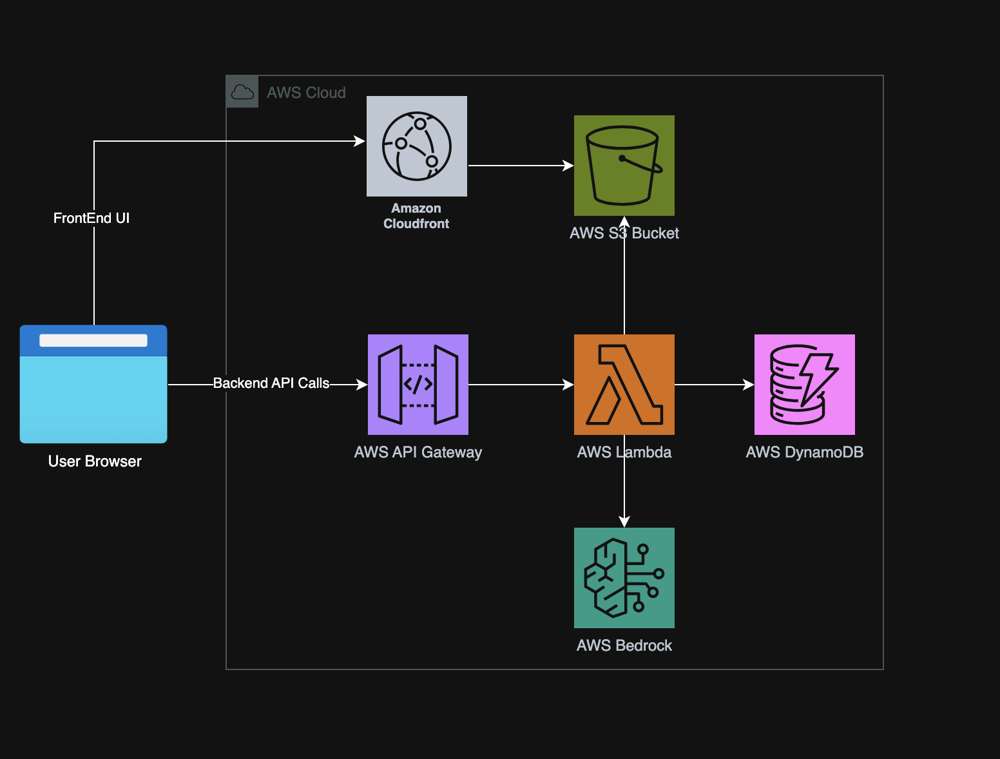
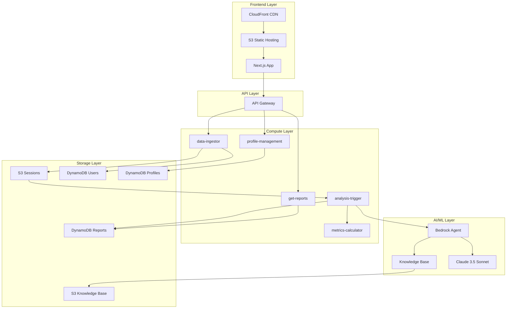
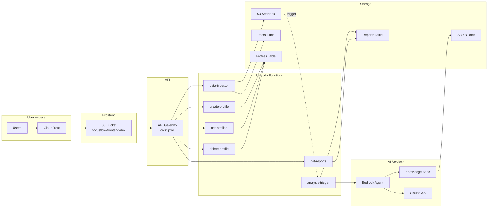
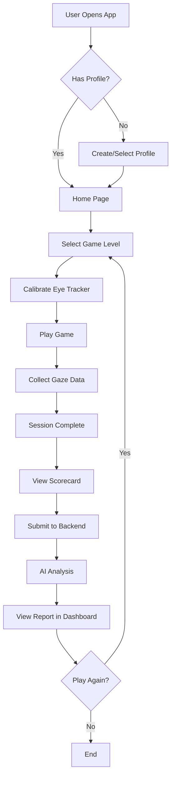
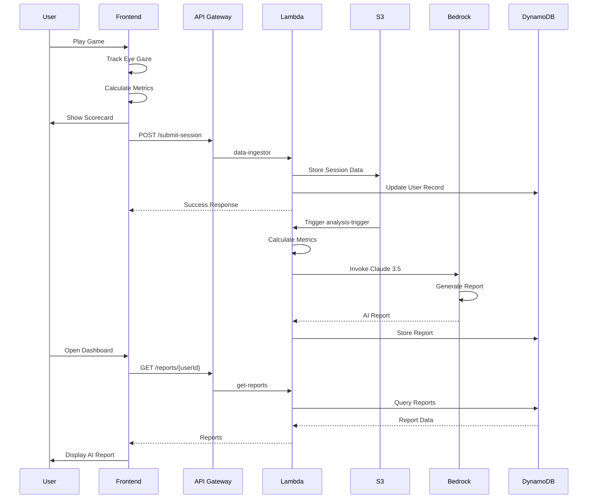

# FocusFlow AI

> AI-Powered Eye-Gaze Tracking Therapy Platform for Children with Autism Spectrum Disorder

[](https://aws.amazon.com/)
[](https://aws.amazon.com/bedrock/)
[](https://nextjs.org/)
[](https://www.terraform.io/)

## 📋 Table of Contents

- [Overview](#overview)
- [How It Helps](#how-it-helps)
- [Technical Architecture](#technical-architecture)
- [Application Flow](#application-flow)
- [Features](#features)
- [Technology Stack](#technology-stack)
- [AWS Components](#aws-components)
- [Challenges & Solutions](#challenges--solutions)
- [Local Development Setup](#local-development-setup)
- [Deployment](#deployment)
- [Project Structure](#project-structure)
- [API Documentation](#api-documentation)
- [Testing](#testing)
- [Contributing](#contributing)
- [License](#license)

---

## 🎯 Overview

**FocusFlow AI** is an innovative therapeutic platform that combines eye-gaze tracking technology with artificial intelligence to help children with Autism Spectrum Disorder (ASD) improve their visual attention and focus skills. The platform provides engaging, game-based exercises that track eye movements in real-time and generates personalized AI-powered progress reports for therapists and parents.

### Key Capabilities

- **Real-time Eye-Gaze Tracking**: Browser-based eye tracking using WebGazer.js
- **Interactive Therapy Games**: Three difficulty levels designed by therapists
- **AI-Powered Analysis**: Comprehensive session reports generated by Claude 3.5 Sonnet
- **Research-Backed Insights**: Knowledge base of peer-reviewed eye-gaze research
- **Progress Tracking**: Historical performance analysis and trend identification
- **Profile Management**: Multi-patient support for therapists

---

## 💡 How It Helps

### For Children with ASD

- **Engaging Gameplay**: Fun, colorful games that don't feel like therapy
- **Skill Development**: Improves visual attention, focus, and tracking abilities
- **Immediate Feedback**: Real-time visual cues and performance indicators
- **Progressive Difficulty**: Three levels that adapt to skill development
- **Safe Environment**: No pressure, self-paced learning

### For Parents

- **Detailed Reports**: AI-generated insights after each session
- **Progress Tracking**: See improvements over time with visual metrics
- **Actionable Recommendations**: Specific suggestions for home practice
- **Encouraging Feedback**: Positive, supportive language from AI therapist
- **Accessibility**: Practice at home, no special equipment needed

### For Therapists

- **Patient Management**: Track multiple patients with profile system
- **Data-Driven Insights**: Objective metrics on attention and focus
- **Research Integration**: AI analysis backed by peer-reviewed studies
- **Time Efficiency**: Automated report generation saves hours
- **Treatment Planning**: Identify strengths and areas needing support

---

## 🏗️ Technical Architecture

### AWS High-Level Design



### High-Level Architecture



### AWS Component Architecture



---

## 🔄 Application Flow

### User Journey



### Data Flow



---

## ✨ Features

### 🎮 Interactive Therapy Games

#### 1. Follow the Leader (Level 1)
- **Objective**: Track a moving object across the screen
- **Skills**: Basic visual tracking, sustained attention
- **Metrics**: Tracking accuracy, time on target, focus score

#### 2. Collision Course (Level 2)
- **Objective**: Track target while avoiding distractors
- **Skills**: Selective attention, distractor filtering
- **Metrics**: Collisions avoided, distractor resistance

#### 3. Find the Pattern (Level 3)
- **Objective**: Identify and track pattern sequences
- **Skills**: Pattern recognition, working memory
- **Metrics**: Patterns identified, sequence accuracy

### 📊 Enhanced Scorecard

- **Performance Badges**: Master, Expert, Developing, Practice
- **Color-Coded Metrics**: Visual indicators for quick assessment
- **Level-Specific Insights**: Tailored feedback per game type
- **Progress Comparison**: Track improvement over time
- **Personal Bests**: Celebrate achievements

### 🤖 AI-Powered Reports

- **Comprehensive Analysis**: 5000+ character detailed reports
- **Research-Backed**: Insights from peer-reviewed studies
- **Personalized Recommendations**: Specific action items
- **Encouraging Tone**: Supportive, therapeutic language
- **Parent-Friendly**: Easy to understand, actionable

### 👥 Profile Management

- **Multi-Patient Support**: Therapists can manage multiple children
- **Age-Appropriate**: Validates age range (3-18 years)
- **Demographic Tracking**: Age, gender, physical metrics
- **Profile Switching**: Easy patient selection
- **Data Isolation**: Each profile's data kept separate

---

## 🛠️ Technology Stack

### Frontend
- **Framework**: Next.js 14 (React 18)
- **Language**: TypeScript
- **Eye Tracking**: WebGazer.js
- **Styling**: CSS Modules
- **State Management**: React Hooks
- **Build Tool**: Next.js built-in

### Backend
- **Runtime**: Node.js 20.x
- **Language**: JavaScript
- **API**: REST (API Gateway)
- **Functions**: AWS Lambda
- **AI Model**: Claude 3.5 Sonnet (Bedrock)

### Infrastructure
- **IaC**: Terraform
- **Cloud Provider**: AWS
- **Region**: us-east-1
- **CDN**: CloudFront
- **Storage**: S3, DynamoDB

### AI/ML
- **LLM**: Claude 3.5 Sonnet (anthropic.claude-sonnet-4-5)
- **Agent**: Amazon Bedrock Agent
- **Knowledge Base**: Amazon Bedrock Knowledge Base
- **Vector Store**: Amazon OpenSearch Serverless
- **Embeddings**: Amazon Titan Embeddings

---

## ☁️ AWS Components

### Compute
| Service | Resource | Purpose |
|---------|----------|---------|
| Lambda | `focusflow-data-ingestor-dev` | Receives and stores session data |
| Lambda | `focusflow-get-reports-dev` | Retrieves AI reports |
| Lambda | `focusflow-analysis-trigger-dev` | Triggers AI analysis on S3 upload |
| Lambda | `focusflow-metrics-calculator-dev` | Calculates session metrics |
| Lambda | `focusflow-create-profile-dev` | Creates patient profiles |
| Lambda | `focusflow-get-profiles-dev` | Lists patient profiles |
| Lambda | `focusflow-delete-profile-dev` | Deletes patient profiles |
| Lambda | `focusflow-research-rag-dev` | RAG queries to knowledge base |

### Storage
| Service | Resource | Purpose |
|---------|----------|---------|
| S3 | `focusflow-frontend-dev` | Static website hosting |
| S3 | `focusflow-sessions-dev` | Session data storage |
| S3 | `focusflow-bedrock-kb-dev` | Research papers for KB |
| DynamoDB | `focusflow-users-dev` | User records |
| DynamoDB | `focusflow-reports-dev` | AI-generated reports |
| DynamoDB | `focusflow-profiles-dev` | Patient profiles |

### Networking
| Service | Resource | Purpose |
|---------|----------|---------|
| CloudFront | `E1CP1219GKD5ZW` | CDN for frontend |
| API Gateway | `oiks1jrjw2` | REST API endpoint |

### AI/ML
| Service | Resource | Purpose |
|---------|----------|---------|
| Bedrock Agent | `focusflow-agent-dev` | Orchestrates AI analysis |
| Bedrock KB | `focusflow-kb-dev` | Research paper knowledge base |
| OpenSearch | Serverless collection | Vector storage for KB |

### Security
| Service | Resource | Purpose |
|---------|----------|---------|
| IAM Role | `focusflow-lambda-role-dev` | Lambda execution role |
| IAM Policy | Various inline policies | Permissions for services |

---

## 🚧 Challenges & Solutions

### Challenge 1: Real-Time Eye Tracking in Browser
**Problem**: Eye tracking typically requires specialized hardware  
**Solution**: Implemented WebGazer.js for webcam-based tracking with calibration system  
**Result**: Accessible eye tracking without special equipment

### Challenge 2: API Gateway Lambda Permission Mismatch
**Problem**: Lambda functions returning 500 errors due to wrong API Gateway permissions  
**Solution**: Identified orphaned API Gateway, added correct permissions for active gateway  
**Result**: All endpoints working with 200/201 responses

### Challenge 3: Bedrock Model Access Permissions
**Problem**: `AccessDeniedException` when invoking Bedrock models  
**Solution**: Added `bedrock:InvokeModel` permission to Lambda IAM role  
**Result**: AI reports generating successfully in 30-60 seconds

### Challenge 4: Knowledge Base Integration
**Problem**: Complex setup for Bedrock Agent with custom knowledge base  
**Solution**: Created automated scripts for document processing and KB setup  
**Result**: Seamless integration of research papers into AI analysis

### Challenge 5: Cross-Device User Tracking
**Problem**: Users losing session history when switching devices  
**Solution**: Implemented localStorage-based userId with profile system  
**Result**: Device-specific tracking with optional profile-based continuity

### Challenge 6: Large Session Data Storage
**Problem**: Eye-gaze data can be 100KB+ per session  
**Solution**: S3 for raw data, DynamoDB for metadata and reports  
**Result**: Cost-effective storage with fast query performance

### Challenge 7: AI Report Generation Time
**Problem**: Bedrock calls taking 20-30 seconds  
**Solution**: Asynchronous processing with S3 trigger, user sees scorecard immediately  
**Result**: No blocking UI, reports available within 60 seconds

### Challenge 8: Terraform State Management
**Problem**: Multiple API Gateways and CloudFront distributions created  
**Solution**: Proper state management, import existing resources, clean up orphans  
**Result**: Single source of truth for infrastructure

---

## 💻 Local Development Setup

### Prerequisites

- Node.js 18+ and npm
- AWS CLI configured
- Terraform 1.0+
- AWS Account with appropriate permissions
- Git

### Frontend Setup

```bash
# Clone the repository
git clone <repository-url>
cd focus-flow-ai

# Install frontend dependencies
cd frontend
npm install

# Create environment file
cp .env.example .env.local

# Update .env.local with your API Gateway URL
NEXT_PUBLIC_API_URL=https://your-api-gateway-url/dev

# Run development server
npm run dev

# Open browser
open http://localhost:3000
```

### Backend Setup

```bash
# Navigate to infrastructure
cd infra/terraform

# Initialize Terraform
terraform init

# Review planned changes
terraform plan

# Apply infrastructure (requires AWS credentials)
terraform apply

# Note the API Gateway URL from outputs
```

### Lambda Function Development

```bash
# Navigate to function directory
cd backend/functions/data-ingestor

# Install dependencies
npm install

# Test locally (optional)
node index.js

# Package for deployment
zip -r ../data-ingestor.zip .

# Deploy via Terraform or AWS CLI
aws lambda update-function-code \
  --function-name focusflow-data-ingestor-dev \
  --zip-file fileb://../data-ingestor.zip
```

### Knowledge Base Setup

```bash
# Prepare research documents
cd backend/bedrock/knowledge-base
./scripts/prepare-research-documents.sh

# Upload to S3
aws s3 sync research/papers/ s3://focusflow-bedrock-kb-dev/research/

# Sync knowledge base (via AWS Console or API)
```

---

## 🚀 Deployment

### Frontend Deployment

```bash
# Build production frontend
cd frontend
npm run build

# Deploy to S3
aws s3 sync out/ s3://focusflow-frontend-dev/ --delete

# Invalidate CloudFront cache
aws cloudfront create-invalidation \
  --distribution-id E1CP1219GKD5ZW \
  --paths "/*"

# Verify deployment
curl https://d3sy81kn37rion.cloudfront.net/
```

### Backend Deployment

#### Option 1: Terraform (Recommended)

```bash
cd infra/terraform

# Review changes
terraform plan

# Apply all infrastructure changes
terraform apply

# Outputs will show API Gateway URL and other resources
```

#### Option 2: Manual Lambda Deployment

```bash
# Package each Lambda function
cd backend/functions

for func in */; do
  cd $func
  zip -r ../${func%/}.zip .
  cd ..
done

# Deploy each function
aws lambda update-function-code \
  --function-name focusflow-data-ingestor-dev \
  --zip-file fileb://data-ingestor.zip

aws lambda update-function-code \
  --function-name focusflow-get-reports-dev \
  --zip-file fileb://get-reports.zip

# Repeat for all functions...
```

### Complete System Deployment

```bash
# Use the deployment script
./scripts/deploy-complete-system.sh

# This script will:
# 1. Build frontend
# 2. Deploy to S3
# 3. Invalidate CloudFront
# 4. Package Lambda functions
# 5. Deploy via Terraform
# 6. Run health checks
```

### Deployment Verification

```bash
# Test API endpoints
./scripts/test-api-endpoints.sh

# Expected output:
# ✅ GET /reports - Status: 200
# ✅ POST /submit-session - Status: 200
# ✅ GET /profiles - Status: 200
# ✅ POST /profiles - Status: 201
# ✅ DELETE /profiles - Status: 200
```

---

## 📁 Project Structure

```
focus-flow-ai/
├── frontend/                    # Next.js frontend application
│   ├── app/                    # Next.js 14 app directory
│   │   ├── page.tsx           # Home page
│   │   ├── game/              # Game pages
│   │   ├── dashboard/         # Reports dashboard
│   │   └── profiles/          # Profile management
│   ├── components/            # React components
│   │   ├── SessionSummary.tsx # Enhanced scorecard
│   │   ├── ProfileModal.tsx   # Profile selector
│   │   └── ...
│   ├── lib/                   # Utility libraries
│   │   ├── api.ts            # API client
│   │   ├── sessionHistory.ts # Session tracking
│   │   ├── performanceAnalyzer.ts # Metrics analysis
│   │   └── profiles.ts       # Profile management
│   ├── public/               # Static assets
│   └── package.json
│
├── backend/                    # Backend services
│   ├── functions/             # Lambda functions
│   │   ├── data-ingestor/    # Session data ingestion
│   │   ├── get-reports/      # Report retrieval
│   │   ├── analysis-trigger/ # AI analysis trigger
│   │   ├── metrics-calculator/ # Metrics calculation
│   │   ├── create-profile/   # Profile creation
│   │   ├── get-profiles/     # Profile listing
│   │   ├── delete-profile/   # Profile deletion
│   │   └── research-rag/     # RAG queries
│   └── bedrock/              # Bedrock configuration
│       └── knowledge-base/   # Research papers
│
├── infra/                     # Infrastructure as Code
│   └── terraform/            # Terraform configuration
│       ├── main.tf           # Main configuration
│       ├── variables.tf      # Variables
│       ├── outputs.tf        # Outputs
│       └── modules/          # Terraform modules
│           ├── api-gateway/  # API Gateway setup
│           ├── lambda/       # Lambda functions
│           ├── dynamodb/     # DynamoDB tables
│           ├── s3/          # S3 buckets
│           ├── frontend/    # CloudFront + S3
│           └── bedrock/     # Bedrock Agent + KB
│
├── scripts/                   # Utility scripts
│   ├── deploy-complete-system.sh
│   ├── test-api-endpoints.sh
│   └── prepare-research-documents.sh
│
├── docs/                      # Additional documentation
│   ├── API.md                # API documentation
│   ├── DEPLOYMENT.md         # Deployment guide
│   └── TROUBLESHOOTING.md    # Common issues
│
└── README.md                  # This file
```

---

## 📚 API Documentation

### Base URL
```
https://oiks1jrjw2.execute-api.us-east-1.amazonaws.com/dev
```

### Endpoints

#### Submit Session
```http
POST /submit-session
Content-Type: application/json

{
  "userId": "string",
  "sessionId": "string",
  "profileId": "string",
  "profileName": "string",
  "profileAge": number,
  "profileGender": "string",
  "level": "string",
  "startTime": number,
  "endTime": number,
  "sessionDuration": number,
  "datePlayed": "string",
  "gazeData": [...],
  "events": [...],
  "metrics": {...}
}

Response: 200 OK
{
  "message": "Session data received successfully",
  "s3Key": "sessions/user_123/session_456.json",
  "sessionId": "session_456"
}
```

#### Get Reports
```http
GET /reports/{userId}

Response: 200 OK
{
  "userId": "user_123",
  "reports": [
    {
      "sessionId": "session_456",
      "timestamp": 1760874242706,
      "report": "# FocusFlow AI Therapeutic Session Report...",
      "modelUsed": "claude-sonnet-4.5",
      "s3Key": "sessions/user_123/session_456.json"
    }
  ],
  "count": 1
}
```

#### Create Profile
```http
POST /profiles
Content-Type: application/json

{
  "therapistId": "string",
  "name": "string",
  "age": number (3-18),
  "gender": "string",
  "weight": number (optional),
  "height": number (optional)
}

Response: 201 Created
{
  "message": "Profile created successfully",
  "profile": {
    "profileId": "FOC-001",
    "therapistId": "therapist_123",
    "name": "John Doe",
    "age": 10,
    "gender": "male",
    "createdAt": 1760874242706
  }
}
```

#### Get Profiles
```http
GET /profiles/{therapistId}

Response: 200 OK
{
  "therapistId": "therapist_123",
  "profiles": [...],
  "count": 5
}
```

#### Delete Profile
```http
DELETE /profiles/{therapistId}/{profileId}

Response: 200 OK
{
  "message": "Profile deleted successfully",
  "profileId": "FOC-001"
}
```

---

## 🧪 Testing

### Run Frontend Tests
```bash
cd frontend
npm test
```

### Test API Endpoints
```bash
./scripts/test-api-endpoints.sh
```

### Manual Testing Checklist

- [ ] Frontend loads on CloudFront URL
- [ ] Eye tracker calibration works
- [ ] All three game levels playable
- [ ] Scorecard displays after game
- [ ] Session submits to backend
- [ ] AI report generates within 60 seconds
- [ ] Dashboard shows reports
- [ ] Profile creation works
- [ ] Profile switching works
- [ ] Profile deletion works

### Monitor Logs
```bash
# API Gateway logs
aws logs tail /aws/apigateway/focusflow-dev --follow

# Lambda logs
aws logs tail /aws/lambda/focusflow-data-ingestor-dev --follow
aws logs tail /aws/lambda/focusflow-analysis-trigger-dev --follow
```

---

## 🤝 Contributing

Contributions are welcome! Please follow these steps:

1. Fork the repository
2. Create a feature branch (`git checkout -b feature/amazing-feature`)
3. Commit your changes (`git commit -m 'Add amazing feature'`)
4. Push to the branch (`git push origin feature/amazing-feature`)
5. Open a Pull Request

### Development Guidelines

- Follow existing code style
- Add tests for new features
- Update documentation
- Ensure all tests pass
- Keep commits atomic and well-described

---

## 📄 License

This project is licensed under the MIT License - see the [LICENSE](LICENSE) file for details.

---

## 🙏 Acknowledgments

- **WebGazer.js** - Browser-based eye tracking
- **Amazon Bedrock** - AI/ML capabilities
- **Claude 3.5 Sonnet** - Natural language generation
- **Next.js Team** - Excellent React framework
- **Terraform** - Infrastructure as Code
- **Research Community** - Eye-gaze studies that inform our approach

---

## 📞 Support

For issues, questions, or contributions:

- **Issues**: [GitHub Issues](https://github.com/your-repo/issues)
- **Documentation**: [docs/](./docs/)
- **Email**: support@focusflow-ai.com

---

## 🗺️ Roadmap

### Phase 1: Core Platform ✅
- [x] Eye-gaze tracking implementation
- [x] Three therapy game levels
- [x] AI report generation
- [x] Profile management
- [x] Progress tracking

### Phase 2: Enhancements (In Progress)
- [ ] Mobile app (iOS/Android)
- [ ] Real-time multiplayer games
- [ ] Therapist dashboard with analytics
- [ ] Export reports to PDF
- [ ] Multi-language support

### Phase 3: Advanced Features (Planned)
- [ ] Custom game creation tools
- [ ] Integration with EHR systems
- [ ] Video session recording
- [ ] Parent training modules
- [ ] Telehealth integration

---

**Built with ❤️ for children with ASD and their families**
